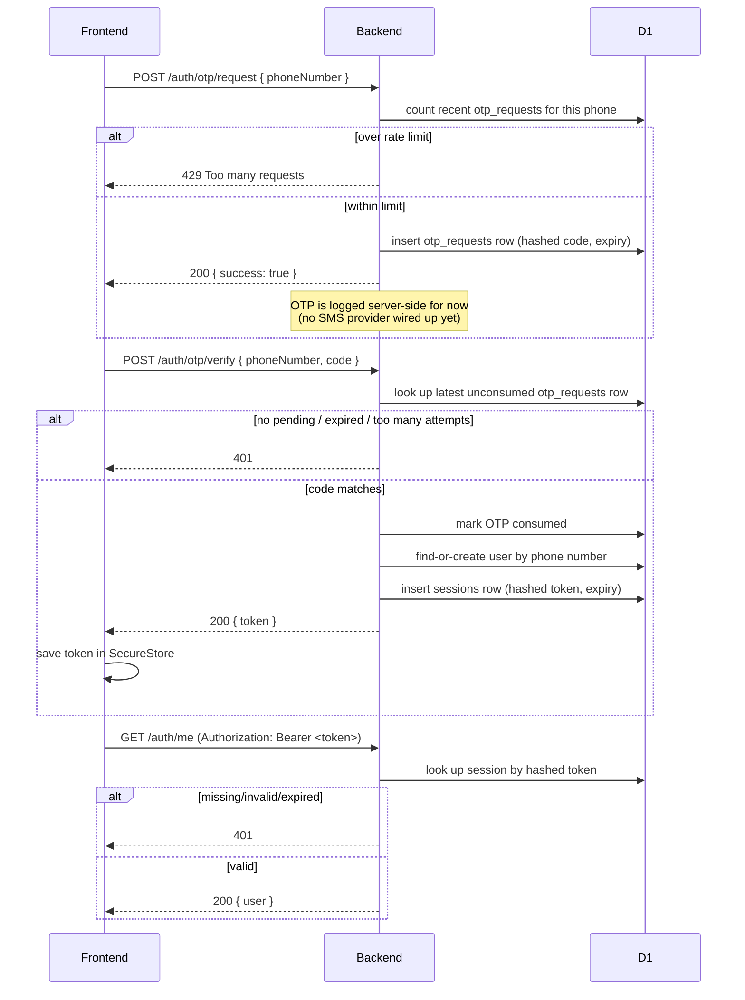

# Phone OTP authentication

Phone number + one-time code is the only sign-up/login method — no email/password, no third-party
auth provider (see [CLAUDE.md](../CLAUDE.md) for why).

## Flow



## Values (documented here so they can be tuned without re-reading code)

| Value | Default | Where |
|---|---|---|
| OTP length | 6 digits | `backend/src/auth/otp.ts` |
| OTP expiry | 5 minutes | `OTP_EXPIRY_MINUTES` |
| Max incorrect verify attempts before an OTP is locked out | 5 | `OTP_MAX_VERIFY_ATTEMPTS` |
| Rate limit | 5 requests per phone number per rolling 60 minutes | `OTP_RATE_LIMIT_MAX` / `OTP_RATE_LIMIT_WINDOW_MINUTES` |
| Session duration | 30 days | `SESSION_DURATION_DAYS` in `backend/src/auth/session.ts` |
| Frontend resend cooldown | 30 seconds (client-side only; the real guard is the server rate limit above) | `RESEND_COOLDOWN_SECONDS` in `frontend/src/screens/OtpEntryScreen.tsx` |

Phone numbers must be in E.164 format (e.g. `+919876543210`) — validated both client- and
server-side.

## How OTP delivery works

**MSG91** is wired up as the real SMS provider (`backend/src/auth/msg91.ts`), chosen specifically
because it reliably delivers to Indian numbers without needing a separate DLT-registered sender
template for OTP-specific messages — many international routes (Twilio included) are commonly
blocked by Indian carriers for exactly this reason.

It's **on/off based on whether `MSG91_AUTH_KEY` is set** (`backend/src/auth/send-otp.ts`):

- **Not set** (local dev by default) — falls back to logging the code server-side instead:
  ```
  [otp] +919876543210 -> 482913 (expires in 5m)
  ```
  visible in the `wrangler dev` terminal, so the full flow is testable end to end without any
  account.
- **Set** (production, via `wrangler secret put MSG91_AUTH_KEY`) — sends a real SMS via MSG91's
  OTP API (`https://control.msg91.com/api/v5/otp`), using our own already-generated/hashed code
  (MSG91 is purely the delivery channel; our own `auth/otp.ts` still owns generation, hashing,
  rate-limiting, and verification). If the MSG91 call itself fails for any reason, it logs the
  code as a fallback instead of failing the request outright — the OTP is already stored, so it can
  still be relayed manually if needed.

Get an MSG91 auth key from your dashboard (Settings → API Keys) after signing up at
[msg91.com](https://msg91.com); local dev keys go in `backend/.dev.vars` (gitignored).

## Security notes

- **OTP codes and session tokens are never stored in plaintext.** Both are hashed (SHA-256) before
  being written to D1, so a database dump doesn't expose usable codes or active sessions.
- **The OTP is never echoed back in an HTTP response.** `POST /auth/otp/request` only ever returns
  `{ success: true }` (or an error) — even though the stub sender logs the code for local dev
  convenience.
- Session tokens are opaque, cryptographically random (32 bytes), and passed as a Bearer token:
  `Authorization: Bearer <token>`.
- The frontend stores the session token in **Expo SecureStore**, not `AsyncStorage` — SecureStore
  is backed by the OS keychain/keystore rather than plain unencrypted storage.

## Protected routes

`backend/src/auth/middleware.ts` exports `requireSession`, a Hono middleware that validates the
`Authorization` header and attaches the resolved user to the request context (`c.get("user")`).
`GET /auth/me` is a minimal example route using it — this is the pattern every protected route
from Phase 4 onward should follow.
