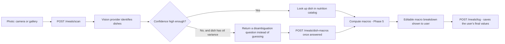

# Meal scanning

User photographs a meal, gets back an editable macro breakdown, and can log it.

## Pipeline

If the vision provider itself fails or times out, `/meals/scan` still returns `200` with
`visionFailed: true` and an empty dish list — the app falls back to a manual-entry form rather
than crashing or showing a raw error.

## Vision provider: Gemini

**Chosen: Gemini 2.5 Flash** (per the brief's either/or; not 1.5-flash, which has been retired by
Google, and not 2.0-flash, where some Google accounts see a 0-quota free tier until it's separately
enabled). Reasoning: generous free tier, strong
multimodal (image) support, and Cloudflare Workers can call it directly over `fetch` with no SDK —
no extra dependency needed for a Workers-compatible client.

It's **on/off based on whether `GEMINI_API_KEY` is set** (`backend/src/vision/provider.ts`'s
`createVisionProvider`), mirroring how MSG91 was wired up for OTP delivery (see
[docs/auth.md](auth.md)):

- **Not set** (local dev by default) — `/meals/scan` uses `stubVisionProvider`
  (`backend/src/vision/provider.ts`), a fixed, deterministic result (no network call, no cost), so
  the full flow is testable end to end without a Gemini account.
- **Set** (production, via `wrangler secret put GEMINI_API_KEY`) — `scanWithGemini`
  (`backend/src/vision/gemini.ts`) POSTs the photo (base64 JPEG) and a prompt to Gemini's
  `generateContent` endpoint, listing the known `dishes.name` catalog values by name and asking it
  to identify every distinct item (counting duplicates rather than describing them collectively),
  preferring the exact catalog name only when it's genuinely that dish, and to always include its
  own best-effort `estimatedMacros` for the whole visible quantity of each item. A label outside the
  catalog isn't an error — it just comes back `matched: false` from `scanMeal`.

If the Gemini call itself throws (bad key, timeout, malformed response), `scanMeal`'s existing
try/catch already handles it — the caller gets `visionFailed: true` and falls back to manual entry,
never a raw error.

Get a free-tier Gemini API key from [aistudio.google.com/apikey](https://aistudio.google.com/apikey);
local dev keys go in `backend/.dev.vars` (gitignored).

Swapping to GPT-4V instead would mean writing a different function with the same `VisionProvider`
signature — the rest of the app (confidence/disambiguation/macro logic, the three `/meals/*`
endpoints, and the frontend) wouldn't need to change either way.

## Confidence and disambiguation

Vision output is never trusted blindly for dishes where the macros can vary a lot based on how
much oil/ghee was used (see Phase 5's oil-variance model in
[docs/nutrition-engine.md](nutrition-engine.md)). The rule (`backend/src/meals/scan.ts`):

> A dish needs disambiguation only if **both** (a) it has recorded oil variance (dal, paneer
> curry, chicken curry, sabzi — not rice, egg, fruit, etc.) **and** (b) the vision confidence is
> below `0.6`.

When that's true, `/meals/scan` returns that dish with `needsDisambiguation: true` and a
`disambiguationQuestion` ("How much ghee/oil was used, roughly?") instead of a guessed macro
value. The app shows a low/medium/high picker; once answered, `POST /meals/dish-macros` computes
the real macros for that answer (reusing Phase 5's `calculateDishMacros`).

Low-confidence dishes with *no* oil variance (a blurry photo of a boiled egg, say) still get a
macro estimate — there's nothing to disambiguate since there's only one plausible value.

## Unmatched dishes: the vision provider's own macro estimate as a fallback

An unrecognized dish label (not in the `dishes` catalog at all) is marked `matched: false`. Rather
than showing a bare zero, `scanMeal` (`backend/src/meals/scan.ts`) falls back to the vision
provider's own `estimatedMacros` for that item when one was supplied — Gemini already has a
reasonable sense of a common food's macros without needing a database lookup, and this covers the
huge long tail of dishes too specific or too varied to ever fully catalog (parathas, chutneys,
regional variants, raw ingredients, etc.).

Every `DishScanResult` carries a `macrosSource`: `"catalog"` (looked up from the nutrition
database — trustworthy, and what's used for oil-variable dishes once disambiguated) or
`"estimated"` (the vision provider's own guess, used only when there's no catalog match at all). The
results screen labels estimated macros as "(AI estimate)" so the user knows to double-check them,
rather than presenting a rough guess with the same confidence as a real lookup. If there's no
catalog match *and* no estimate either, the dish still falls back to "couldn't match to a known
dish" with an empty macro field, same as before.

This is a deliberate accuracy vs. trust tradeoff: catalog-matched dishes (especially oil-variable
ones, where getting fat/calories right depends on a confirmed cooking method) stay authoritative,
while everything else gets a usable starting estimate instead of forcing a fully manual entry.

## Editable macro breakdown and logging

The results screen always shows the (possibly multi-dish) macro breakdown as **editable** number
fields, pre-filled with the computed sum across all identified dishes. It also shows a meal-type
picker (Breakfast/Morning Snack/Lunch/Evening Snack/Dinner), pre-selected by a time-of-day guess
(`guessMealType` in `frontend/src/meals/mealTypes.ts`) but fully changeable before confirming.
`POST /meals/log` saves exactly whatever is in those fields (and whichever meal type is selected)
at confirm time — if the user corrects a value before confirming, the corrected value is what gets
written to `meals_logged`, not the original scan estimate (see
`backend/test/meals/routes.spec.ts`'s end-to-end test for this).

`meals_logged` stores one row per logged meal (which may span multiple dishes):
`dish_labels` (all dish names in the plate), `portion_estimate` (opaque JSON — whatever shape the
client used to arrive at the macros, e.g. per-dish portion multipliers), `macros` (the final
combined totals), and `meal_type` (see docs/schema.md).

## Today's detail screen, grouped by meal type

Tapping "Logged today" on the Dashboard opens `TodayDetailScreen`, which groups the same
`GET /meals/today` data the Dashboard already fetches into the 5 meal-type slots (via
`MealTypeSection`) instead of showing one flat list. Each slot shows its own summed calories and
either its logged meals or an empty-state placeholder - there's no backend endpoint specific to
this screen; grouping happens client-side since the data is identical to what Dashboard uses.

## Known gap: no image storage

`meals_logged.source_image_ref` exists in the schema but nothing writes to it yet — the photo
itself isn't uploaded or persisted anywhere; it only exists in memory on the device long enough to
scan it. Wiring up image storage (e.g. Cloudflare R2) is a reasonable follow-up but wasn't in this
phase's scope.

## Endpoints

All require a session (`Authorization: Bearer <token>`):

| Method | Path | Purpose |
|---|---|---|
| `POST` | `/meals/scan` | Image in, per-dish confidence/macros/disambiguation out |
| `POST` | `/meals/dish-macros` | Resolve a disambiguation answer (or portion change) into macros for one dish |
| `POST` | `/meals/log` | Save the final (possibly edited) meal, plus its `mealType`, to `meals_logged` |
| `DELETE` | `/meals/log/:id` | Remove a logged meal - scoped to `WHERE id = ? AND user_id = ?`, so it 404s (not a distinguishable "not yours") both when the id doesn't exist and when it belongs to another user. Does not adjust `usual_meals.frequency_count` - see docs/usual-meals.md's known limitations. |
