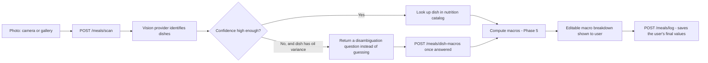

# Meal scanning

User photographs a meal, gets back an editable macro breakdown, and can log it.

## Pipeline



If the vision provider itself fails or times out, `/meals/scan` still returns `200` with
`visionFailed: true` and an empty dish list — the app falls back to a manual-entry form rather
than crashing or showing a raw error.

## Vision provider: Gemini (currently stubbed)

**Chosen: Gemini 1.5/2.0 Flash** (per the brief's either/or). Reasoning: generous free tier,
strong multimodal (image) support, and Cloudflare Workers can call it directly over `fetch` with
no SDK — no extra dependency needed for a Workers-compatible client.

**Currently stubbed, not actually wired up** (`backend/src/vision/provider.ts`) — no Gemini
account/API key exists yet, so `stubVisionProvider` returns a fixed, deterministic result (no
network call, no cost). This mirrors how OTP delivery was stubbed in Phase 3: the real
integration point is isolated behind one function so swapping it in later doesn't touch any
calling code.

### Swapping in a real provider later

1. Get a Gemini API key, add it to `backend/.dev.vars` as `GEMINI_API_KEY` (already scaffolded in
   `.dev.vars.example`).
2. Implement a new function matching the `VisionProvider` type (`backend/src/vision/provider.ts`):
   ```ts
   export const geminiVisionProvider: VisionProvider = async (imageBase64) => {
     // POST to Gemini's generateContent endpoint with the image + a prompt asking for
     // { dishes: [{ label, confidence, portionMultiplier }] } — parse the JSON response into
     // this shape. `label` must match (or be mapped to) a `dishes.name` row to be recognized.
   };
   ```
3. Swap the default in `backend/src/meals/scan.ts` (`options.visionProvider ?? stubVisionProvider`)
   to the new function once it's tested.
4. Nothing else changes — `scanMeal`'s confidence/disambiguation/macro logic, the three
   `/meals/*` endpoints, and the frontend are all provider-agnostic.

Swapping to GPT-4V instead would mean writing a different function with the same `VisionProvider`
signature — the rest of the app wouldn't need to change either way.

## Confidence and disambiguation

Vision output is never trusted blindly for dishes where the macros can vary a lot based on how
much oil/ghee was used (see Phase 5's oil-variance model in
[docs/nutrition-engine.md](nutrition-engine.md)). The rule (`backend/src/meals/scan.ts`):

> A dish needs disambiguation only if **both** (a) it has recorded oil variance (dal, paneer
> curry, chicken curry, sabzi — not rice, egg, fruit, etc.) **and** (b) the vision confidence is
> below `0.6`.

When that's true, `/meals/scan` returns that dish with `needsDisambiguation: true` and a
`disambiguationQuestion` ("How much ghee/oil was used, roughly?") instead of a guessed macro
value. The app shows a low/medium/high picker; once answered, `POST /meals/dish-macros` computes
the real macros for that answer (reusing Phase 5's `calculateDishMacros`).

Low-confidence dishes with *no* oil variance (a blurry photo of a boiled egg, say) still get a
macro estimate — there's nothing to disambiguate since there's only one plausible value.

An unrecognized dish label (not in the `dishes` catalog at all) is marked `matched: false` with no
macros — shown to the user as "couldn't match," not silently dropped or crashed on.

## Editable macro breakdown and logging

The results screen always shows the (possibly multi-dish) macro breakdown as **editable** number
fields, pre-filled with the computed sum across all identified dishes. `POST /meals/log` saves
exactly whatever is in those fields at confirm time — if the user corrects a value before
confirming, the corrected value is what gets written to `meals_logged`, not the original scan
estimate (see `backend/test/meals/routes.spec.ts`'s end-to-end test for this).

`meals_logged` stores one row per logged meal (which may span multiple dishes):
`dish_labels` (all dish names in the plate), `portion_estimate` (opaque JSON — whatever shape the
client used to arrive at the macros, e.g. per-dish portion multipliers), and `macros` (the final
combined totals).

## Known gap: no image storage

`meals_logged.source_image_ref` exists in the schema but nothing writes to it yet — the photo
itself isn't uploaded or persisted anywhere; it only exists in memory on the device long enough to
scan it. Wiring up image storage (e.g. Cloudflare R2) is a reasonable follow-up but wasn't in this
phase's scope.

## Endpoints

All require a session (`Authorization: Bearer <token>`):

| Method | Path | Purpose |
|---|---|---|
| `POST` | `/meals/scan` | Image in, per-dish confidence/macros/disambiguation out |
| `POST` | `/meals/dish-macros` | Resolve a disambiguation answer (or portion change) into macros for one dish |
| `POST` | `/meals/log` | Save the final (possibly edited) meal to `meals_logged` |
