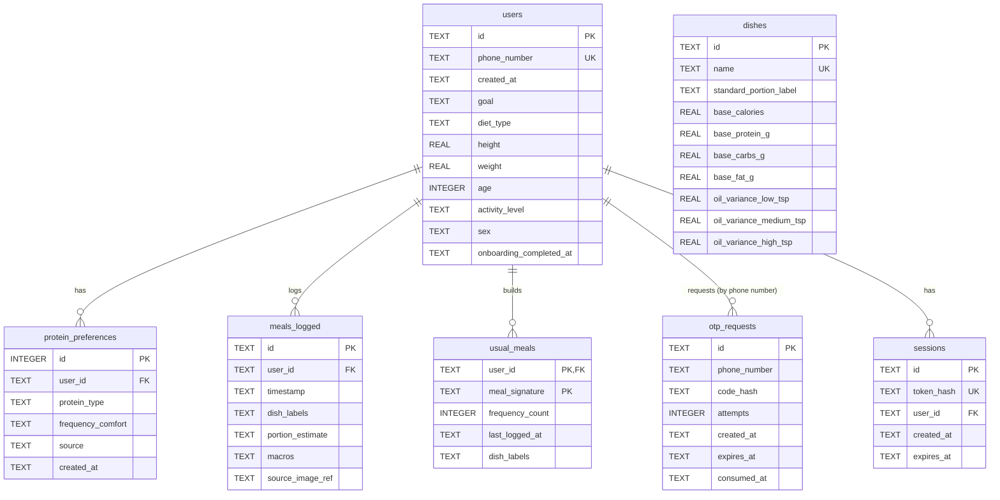

# Database schema

Backend: Cloudflare D1 (SQLite at the edge).

## ER diagram



## Tables, in plain English

### `users`

One row per signed-up parent. Created with just a phone number (Phase 3 — phone OTP auth); the
onboarding fields (`goal`, `diet_type`, `height`, `weight`, `age`, `activity_level`, `sex`) start
out `NULL` and get filled in during onboarding (Phase 4). `phone_number` is unique — a phone
number can only belong to one account. `onboarding_completed_at` is set once the user finishes
Screen 5, and never changes after that (Phase 4). `sex` (Phase 5) exists only because the TDEE
formula needs it — it isn't used anywhere else.

### `protein_preferences`

Which proteins a user is comfortable eating and how often. One row per protein per user
(`UNIQUE(user_id, protein_type)` — a user can't have two rows for "paneer"). `source` records
*how* we know this preference:

- `explicit` — the user told us directly (Phase 9 settings screen)
- `default` — filled in automatically from onboarding answers (Phase 4)
- `inferred` — guessed from logging behavior (Phase 9 passive learning)

`source` is constrained to exactly these three values at the database level (`CHECK` constraint) —
inserting anything else fails.

### `meals_logged`

Every meal a user has scanned or logged. `dish_labels`, `portion_estimate`, and `macros` are
stored as JSON *text* — D1/SQLite has no native JSON column type, so the app is responsible for
`JSON.stringify`/`JSON.parse` on the way in and out. `source_image_ref` is nullable, since a
manually-entered meal (no photo) is still valid.

### `usual_meals`

The personal "usual meals" library (Phase 7) — how often a user logs a particular combination of
dishes. `meal_signature` is a normalized (lowercased, sorted) join of the dish labels, used only
for matching; `dish_labels` stores the original-cased labels from the most recent log, for
display. The exact matching rule (and its known limitations) is spelled out in
[docs/usual-meals.md](usual-meals.md). Primary key is `(user_id, meal_signature)`: logging the
same combination again increments `frequency_count` on the existing row via an atomic
`INSERT ... ON CONFLICT DO UPDATE`, never inserting a duplicate.

### `otp_requests`

Every OTP code ever requested (Phase 3), keyed by phone number rather than `user_id` — a phone
number might not have an account yet the first time it requests a code. `code_hash` is a SHA-256
hash, never the plaintext code. `attempts` counts failed verify attempts against that code (capped
before locking it out); `consumed_at` is set once a code is used (or invalidated).

### `sessions`

Active login sessions (Phase 3). `token_hash` is a SHA-256 hash of the opaque bearer token handed
to the client — the plaintext token is never stored. `expires_at` is 30 days from creation.

### `dishes`

The nutrition catalog (Phase 5) — see [docs/nutrition-engine.md](nutrition-engine.md) for the full
explanation of the base-macros-plus-oil-variance model and how to add a new dish.

## Migrations

Each table has a paired `up`/`down` SQL file in [`backend/migrations/`](../backend/migrations/),
numbered in the order they were introduced. Applied migrations are tracked in a `_migrations`
table (id + timestamp), created automatically the first time you run the migration tooling. A
migration's SQL and its tracking row are written together in a single D1 batch, so a failure
partway through can't leave `_migrations` out of sync with the actual schema.

### Running migrations

Against your local D1 (the SQLite file `wrangler dev` also reads from):

```bash
cd backend
npm run db:migrate           # apply all pending migrations
npm run db:migrate:down      # roll back the most recently applied migration
npm run db:migrate:status    # show which migrations are applied vs. pending
```

To roll back more than one migration: `node scripts/migrate.mjs down --steps=2`.

Against the real (remote) D1 database — only relevant once one exists (see the backend README for
`wrangler d1 create`) — append `--remote`, e.g. `node scripts/migrate.mjs up --remote`.

### Adding a new migration

1. Add a new pair of files: `000N_<description>.up.sql` and `000N_<description>.down.sql` in
   `backend/migrations/`, where `N` is the next number.
2. Register them in `backend/src/db/migrations.ts` (import the two new files, add a `{ id, up, down }`
   entry to the `migrations` array, in order).
3. Add schema tests in `backend/test/db/migrate.spec.ts` following the existing pattern.
